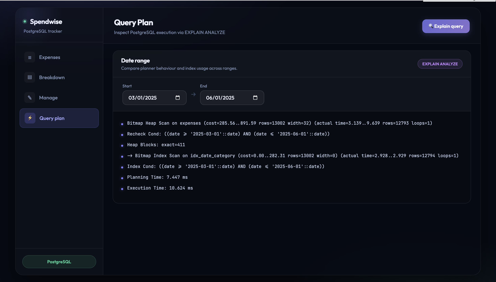
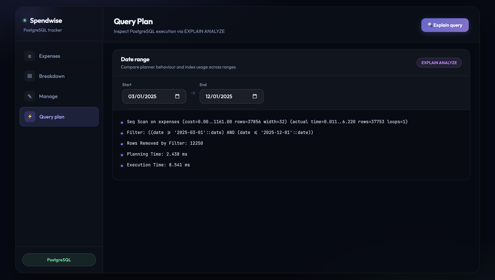
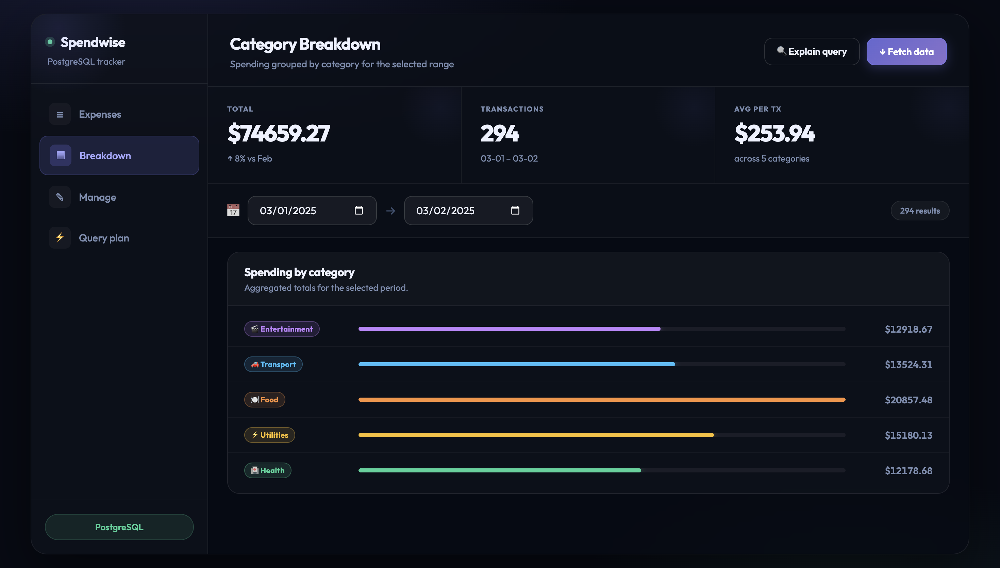
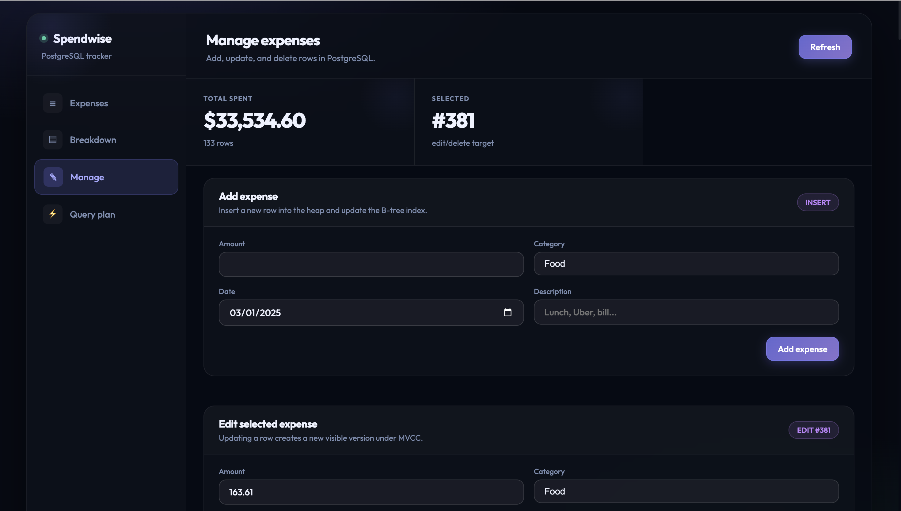

<!-- # Expense Tracker with PostgreSQL Internals Analysis

## Overview

This project is a full-stack expense tracking application designed to demonstrate PostgreSQL internal behavior.

Key concepts explored:

* Heap storage
* B-tree indexing
* Query planning
* MVCC (Multi-Version Concurrency Control)

Tech stack:

* Frontend: React
* Backend: FastAPI
* Database: PostgreSQL

---

## Architecture

User → React → FastAPI → PostgreSQL → Query Planner → Execution → Result

---

## Features

* Add, update, and delete expenses
* Filter expenses by date range
* Category-wise aggregation (summary)
* View PostgreSQL query execution plans (EXPLAIN ANALYZE)

---

## Database Internals Mapping

### 1. Filtering Expenses (SELECT)

Application behavior:
Filter expenses by date range.

Query:
SELECT * FROM expenses WHERE date BETWEEN ...;

Database behavior:

* Uses B-tree index on date
* Performs Bitmap Index Scan
* Performs Bitmap Heap Scan
* Applies MVCC visibility checks

---

### 2. Insert (Add Expense)

Application behavior:
User adds a new expense.

Query:
INSERT INTO expenses ...;

Database behavior:

* New tuple inserted into heap storage
* B-tree index updated
* New row version created

---

### 3. Update Expense

Application behavior:
User edits an expense.

Query:
UPDATE expenses SET ...;

Database behavior:

* New version of row created (MVCC)
* Old version remains temporarily
* Index entries updated if needed

---

### 4. Delete Expense

Application behavior:
User deletes an expense.

Query:
DELETE FROM expenses ...;

Database behavior:

* Row is marked as deleted (not immediately removed)
* Cleaned later by VACUUM

---

### 5. Aggregation (Summary Page)

Application behavior:
View total expenses by category.

Query:
SELECT category, SUM(amount) FROM expenses GROUP BY category;

Database behavior:

* Uses GroupAggregate node
* Scans relevant rows
* Performs aggregation in memory

---

## MVCC Explanation

PostgreSQL uses MVCC (Multi-Version Concurrency Control) to allow concurrent reads and writes.

* Multiple versions of a row are stored
* Reads do not block writes
* Each query sees a consistent snapshot of data
* MVCC is applied during heap access

---

## Running the Project

### Backend

cd backend
- source venv/bin/activate
- uvicorn app.main:app --reload

### Frontend

cd frontend
- npm install
- npm run dev

---

## Dataset

* Synthetic dataset (~50,000 rows)
* Generated using SQL
* Covers multiple categories and date ranges

---

## Key Learning

This project demonstrates how application-level operations map directly to PostgreSQL internals:

* Query → Index traversal + heap access
* Insert → Heap insert + index update
* Update → MVCC row versioning
* Delete → Logical deletion + vacuum cleanup
* Aggregation → GroupAggregate execution

---
 -->
# Expense Tracker with PostgreSQL Query Analysis

## Project Overview
This project is a web-based Expense Tracker application built using FastAPI and PostgreSQL. The primary goal is to analyze how PostgreSQL internally processes queries, focusing on storage, indexing, and query execution behavior.

The project demonstrates how database internals such as heap storage, B-tree indexing, and the query planner directly impact application performance.

---

## Features
- Add, update, and delete expenses  
- Filter expenses by date range and category  
- Generate category-wise summaries  
- Analyze query execution using EXPLAIN ANALYZE  
- Compare performance with and without indexes  

---

## Tech Stack
- Backend: FastAPI (Python)  
- Database: PostgreSQL  
- Frontend: React / HTML / CSS / JavaScript  
- Tools: Uvicorn, SQL, EXPLAIN ANALYZE  

---

## Project Structure
```
expense_tracker/
│
├── backend/
│   ├── app/
│   │   ├── main.py
│   │   ├── crud.py
│   │   ├── db.py
│   │   ├── schemas.py
│   │
│   ├── sql/
│   │   ├── schema.sql
│   │   ├── seed.sql
│   │
│   ├── requirements.txt
│
├── frontend/
│   ├── src/
│   ├── public/
│
├── README.md
```

---

## Setup Instructions

### 1. Clone the Repository
```bash
git clone https://github.com/your-username/expense-tracker.git
cd expense-tracker
```

---

## Backend Setup

### Create Virtual Environment
```bash
cd backend
python3 -m venv venv
```

### Activate Virtual Environment
Mac/Linux:
```bash
source venv/bin/activate
```

Windows:
```bash
venv\Scripts\activate
```

### Install Dependencies
```bash
pip install -r requirements.txt
```

---

## Database Setup (PostgreSQL)

### Create Database
```sql
CREATE DATABASE expense_tracker;
```

### Run Schema
```bash
psql -U your_username -d expense_tracker -f sql/schema.sql
```

### Load Sample Data (Optional)
```bash
psql -U your_username -d expense_tracker -f sql/seed.sql
```

---

## Environment Variables

Create a `.env` file inside the backend folder:

```
DB_HOST=localhost
DB_NAME=expense_tracker
DB_USER=your_username
DB_PASSWORD=your_password
```

Note: Do NOT upload this file to GitHub.

---

## Run Backend
```bash
uvicorn app.main:app --reload
```

API:
http://127.0.0.1:8000

Swagger Docs:
http://127.0.0.1:8000/docs

---

## Run Frontend

If using React:
```bash
cd frontend
npm install
npm run dev
```

If using a simple frontend:
```bash
python -m http.server 8000
```

---

## Reproducing Results

### Without Index
```sql
EXPLAIN ANALYZE
SELECT * FROM expenses
WHERE date BETWEEN '2025-03-01' AND '2025-12-01';
```

Expected:
- Sequential Scan  
- Higher execution cost  

---

### Create Index
```sql
CREATE INDEX idx_date_category
ON expenses(date, category);
```

---

### With Index
```sql
EXPLAIN ANALYZE
SELECT * FROM expenses
WHERE date BETWEEN '2025-03-01' AND '2025-06-01';
```

Expected:
- Bitmap Index Scan  
- Improved performance  

---

## Screenshots

### Query Plan (With Index)


### Query Plan (Without Index)


### Category Breakdown


### Expense Management


---

## Secret Keys & Credentials
- Database credentials must be provided via `.env`  
- No sensitive data is stored in the repository  

---

## Dataset
- Synthetic dataset generated using SQL scripts  
- Data can be loaded using `seed.sql`  
- Alternatively, data can be inserted via the application  

---

## Project Link
GitHub Repository: https://github.com/your-username/expense-tracker

---

## References
- PostgreSQL Documentation – Storage and Indexes  
- PostgreSQL Query Planning Documentation  
- Research on B-tree indexing and query optimization  

---

## Future Improvements
- Larger datasets for performance benchmarking  
- Advanced indexing strategies  
- Distributed database support  

---

## Notes
- Ensure PostgreSQL is running before starting backend  
- Verify database credentials in `.env`  
- Run schema before starting the application  
